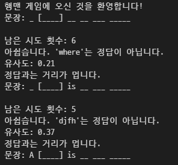

# 요약

## 대상

- 쏙쏙Words에서 영단어를 암기한 뒤 해당 단어를 점검하고자 하는 학생

## 기대효과

- 이미 외웠던 단어와 문장에서 품사의 중요도에 따라 순차적으로 제시되는 힌트를 보며 외웠던 단어를 어떻게 영작할지에 대한 힌트를 얻을 수 있다고 기대.
- 단어를 정확히 외우는 것을 코사인 유사도를 통해 확인해볼 수 있다. 예를들어 답이 bird인데 birdy라고 하면 그 점수가 다른 오답에 비해 높게 나오는데 이런식으로 정답과 가깝게 맞춰갈 수 있다.

## 플레이

- 실행하게 되면 비어 있는 문장이 전체가 비어있게 나오고 정답만 따로 표시되어있음. 계속 시도를 할 수록 품사의 중요도에 따라 순차적으로 힌트가 제공됨. 품사의 중요도는 직접 순서를 지정하여 저장. 총 6번의 기회가 주어지고 정답을 맞추면 게임이 종료되고 기회를 모두 소진 시 원래 답을 제시. 쿄사인 유사도를 함께 제시하며 1.0이 되었을 시 정답으로 표시

### 사용된 데이터셋

천재교육 쏙쏙words 영단어 하루치

---

## 사용된 모델

`SentenceTransformer` : 문장 임베딩
`util` : 사용자가 입력한 답과 정답 사이의 유사도 체크(코사인 유사도 활용)

---

## 진행과정

- word쏙쏙 pdf문서를 폴더안에 넣고 코드를 실행하면 폴더를 읽고 이를 단어, 예문의 순으로 해서 데이터 프레임화 시킵니다. 그렇게 단어가 답이 되고 예문이 문제가 되어 사용자가 답을 입력하면 코사인 유사도를 제시하며 답에 근접할 수 있게 유도합니다.
- 한번의 기회를 소진할 때마다 품사의 중요도에 따라 하나씩 단어가 공개되고 이 순서는 개발자가 직접 라벨링 하였습니다.

- 인터페이스

  

  - 실제 유사도 점수와 정답에 어느정도 근접했는지 제시합니다.

## 개선점

1. **GUI**:
   실제 이용할 수 있게 인터페이스를 개선해야 합니다.

2. **오타에 대한 정확도 조정**:
   한 글자를 틀려도 어디에서 틀리냐에 따라 코사인 유사도 점수가 상이하게 나타나는데 오타는 비교적 원래 단어와 유사하다고 판단 할 수 있는 평가 지표가 필요합니다.
