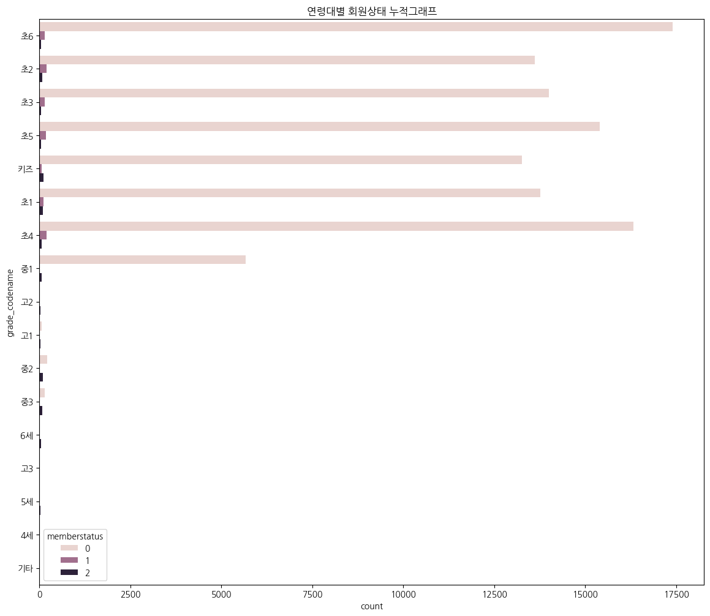
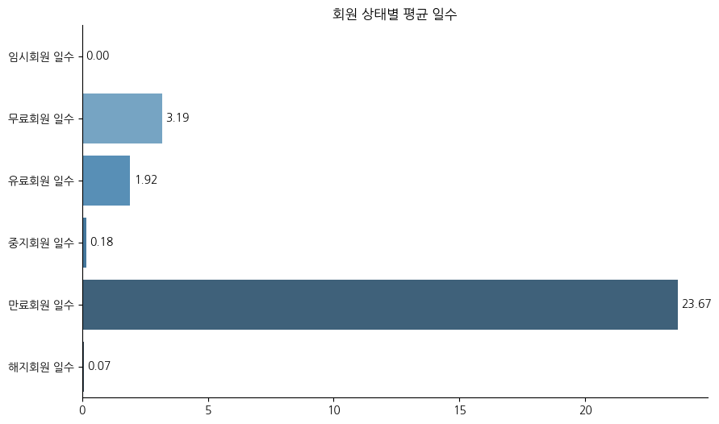
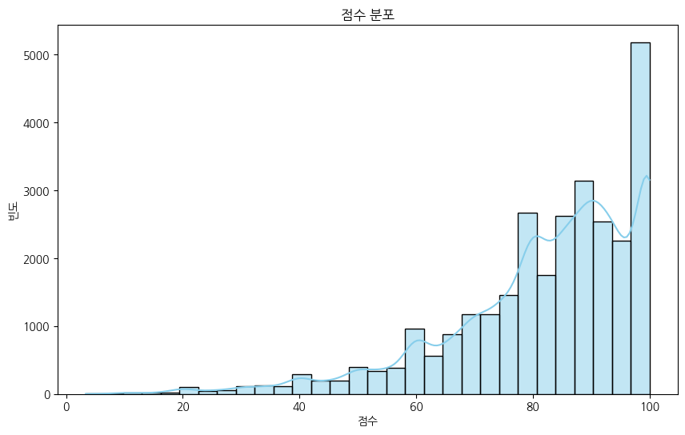
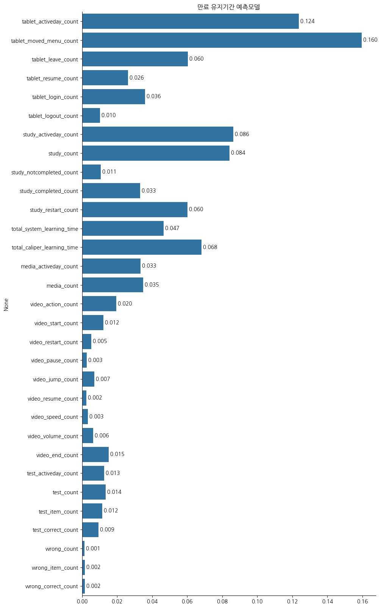
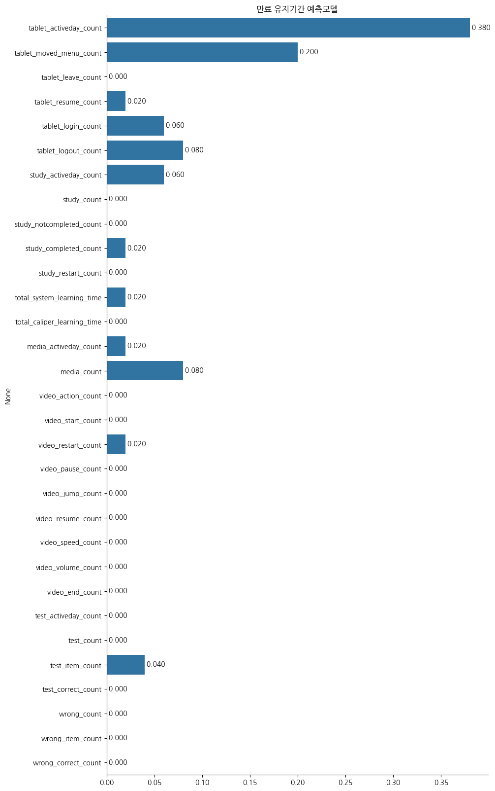

# 기계학습 모델 구현 및 분석 보고서

1. (이름추가)

## 목차

- [문제정의](#문제정의)
- [데이터설명](#데이터-설명)
- [데이터 탐색](#데이터-탐색)
- [전처리](#전처리)
- [EDA](#eda)
- [아이디어](#아이디어)
- [모델선정](#모델선정)
- [결론](#결론)

---

_요약도 추가할 것_

- ### 문제정의

2. (두서가 없음. 어떤 문제가 있는데 데이터분석을 해서 어떤 인사이트를 도출해야하는지 간단명료하게 제시해야 함.)
   ***

- 탈퇴 회원은 기존 서비스를 이용하던 고객이 없어졌기에 손실이고 만료 회원은 잠재적으로 탈퇴를 할 수 있는 회원이다. 만료인 상태로 유지되는 기간이 길어질수록 해당 회원이 다른 서비를 체험하고 더 낫다는 판단이 든다면 옮겨갈 수 있는 가능성이 높아지기에 기간이 길어지기 전에 연장하도록 하는 것이 중요하다. 즉 만료회원이 탈퇴를 하지 않고 서비스를 계속 이용하는 것이 중요한데 최종적으로 만료 상태인 회원이 본사의 어떤 점으로 인해 서비스를 이용하였고 학년이 올라갈수록 필요한 서비스가 무엇인지 알아내고 제공해야 한다. 그 전 단계로 해당 분석에서는 같은 만료상태라도 유지 기간이 어떻게 다르고 이에 영향을 주는 요인은 어떤 것이 있는지 파악해보고자 한다.

- ### 데이터 설명

  ***

  - 데이터셋 : 천재교육 서비스 만료 및 탈퇴회원 데이터

3. shape만 보여주지 말고 sample, feature을 추가하여 제시할 것

- 형태 : (111851, 54)
- 컬럼 설명

4. 메타데이터는 굳이 적을 필요는 없음(별첨자료로 제시)

   ```
       - 유저 정보
           - userid : 회원아이디
           - gender : 성별
           - membertype_codename : 회원구분 코드의 한글명(학교급) ex. 초등
           - grade_codename : 학년 코드
           - memberstatus : 회원상태 (44:만료, 66:미납_중지, 88:탈퇴)
           - memberstatus_codename : 회원상태 코드의 한글명
           - memberstatus_change : 월 중 회원상태 변화

       - 서비스 유지 형태 및 기간
           - status_null_count : 회원상태 없음 일수
           - statusgroup_10_count : 임시회원 일수
           - statusgroup_20_count : 무료회원 일수
           - statusgroup_30_count : 유료회원 일수
           - statusgroup_40_count : 중지회원 일수
           - statusgroup_50_count : 만료회원 일수
           - statusgroup_90_count : 해지회원 일수

       - 포인트
           - point_gain_activeday_count : 포인트 획득일수
           - point_gain_count : 포인트 획득 횟수
           - point_gain : 획득 포인트
           - point_loss_activeday_count : 포인트 차감일수
           - point_loss_count : 포인트 차감 횟수
           - point_loss : 차감 포인트

       - 태블릿
           - tablet_activeday_count : 기기 활성 횟수
           - tablet_moved_menu_count : 기기 메뉴이동 횟수
           - tablet_leave_count :기기 물리적 종료 횟수
           - tablet_resume_count : 기기 물리적 재개 횟수
           - tablet_login_count : 로그인 횟수
           - tablet_logout_count : 기기 로그아웃 횟수

       - 학습
           - study_activeday_count :학습 활성일 횟수
           - study_count : 학습 횟수
           - study_notcompleted_count : 학습 미완료 횟수
           - study_completed_count : 학습 완료 횟수
           - study_restart_count : 학습 재시작 횟수
           - total_system_learning_time : 학습 시간합계(시스템)
           - total_caliper_learning_time : 학습 시간합계(캘리퍼)

       - 미디어
           - media_activeday_count : 미디어 활동 활성 일수
           - media_count : 미디어 학습 횟수

       - 비디오
           - video_action_count : 비디오 활동 횟수
           - video_start_count : 비디오 시작 횟수
           - video_restart_count : 비디오 재시작 횟수
           - video_pause_count : 비디오 일시정지 횟수
           - video_jump_count : 비디오 점프 횟수
           - video_resume_count : 비디오 재개(일시정지 후 횟수)
           - video_speed_count : 비디오 속도 조절 횟수
           - video_volume_count : 비디오 볼륨 조절 횟수
           - video_end_count : 비디오 종료 횟수

       - 시험
           - test_activeday_count : 평가 활성 일수
           - test_count : 평가 횟수
           - test_average_score : 평가 평균 점수
           - test_item_count : 평가 문항 개수
           - test_correct_count : 평가 정답 개수

       - 오답노트
           - wrong_count : 오답 노트 진입 횟수
           - wrong_item_count : 오답 노트 문항 개수
           - wrong_correct_count : 오답 노트 정답 개수

       - 기타
           - yyyy : 년
           - mm : 월
   ```

5. 수치형 자료라는 표현보다는 카테고리, 연속형 등 구체적인 내용을 언급할 것

- 자료형
  위 분류에서 유저정보에 해당하는 부분을 제외하고는 전부 수치형 자료.

* ### 데이터 탐색

  ---

  - #### 중복값 : 없음
  - #### 결측치

6. 양이 많으니 전체를 놓고 퍼센트로 바꿔서 제시하면 좋음

   ```
       point_gain_activeday_count       3955
       point_gain_count                 3955
       point_gain                       3955
       point_loss_activeday_count       3955
       point_loss_count                 3955
       point_loss                       3955
       tablet_activeday_count          69893
       tablet_moved_menu_count         69893
       tablet_leave_count              69893
       tablet_resume_count             69893
       tablet_login_count              69893
       tablet_logout_count             69893
       study_activeday_count           77821
       study_count                     77821
       study_notcompleted_count        77821
       study_completed_count           77821
       study_restart_count             78457
       total_system_learning_time      78584
       total_caliper_learning_time     78496
       media_activeday_count           79605
       media_count                     79605
       video_action_count              80735
       video_start_count               80735
       video_restart_count             80735
       video_pause_count               80735
       video_jump_count                80735
       video_resume_count              80735
       video_speed_count               80735
       video_volume_count              80735
       video_end_count                 80735
       test_activeday_count            82852
       test_count                      82852
       test_average_score              82852
       test_item_count                 83472
       test_correct_count              83472
       wrong_count                    104408
       wrong_item_count               104408
       wrong_correct_count            104408
   ```

   - 결측치 특징

     - 위의 컬럼에 대한 구분에서 유저 정보, 서비스 유지 형태 및 기간, 기타에 해당하는 부분에는 결측치가 없지만 그외의 컬럼에서 결측치 발생

7. 대분류라고 따로 언급을 하고 말할 것

   - 동일한 항목(위에서 나눈 기준) 별로 결측치 수가 대체로 동일

8. 대분류를 언급을 하며 '태블릿 대분류에서 결측치가 발생하면 이후 대분류에서 결측치를 보이는 경향이 많다'
   - 테블릿에서 결측치가 발생하면 이후 기능에 대해선 전부 결측치 발생

- ### 전처리

  ***

  - #### 결측치 : 0으로 대체

    - 사유 : 회원 정보는 결측이나 중복값 없이 존재하지만 결측치가 발생한 부분이 대부분 서비스 내에 있는 기능에서 발생. 즉 이들을 서비스에 가입은 했지만 오답노트, 시험응시 등 해당 기능을 사용하지 않은 유저로 판단하고 전부 수치형 자료이기에 해당 서비스를 이용하지 않은 것으로 생각하여 0으로 대체

  - #### memberstatus

9. 보기 편하게 쓸 것 '44,66,88로 구분된 것을 각각 0,1,2 로 구분했다'
   - 해당 컬럼은 44:만료, 66:미납/중지, 88:탈퇴로 구분되어 숫자로 들어가 있는데 편의상 44 -> 0, 66 -> 1, 88 -> 2로 처리

- #### 학년

10. 비율로 바꾸어 표현하는게 좋다/ 만료된 회원의 **샘플갯수**가 압도적으로 많기 때문에 데이터를 이렇게 썼다/ 샘플이 많아서 썼다고 이야기 하는ㄱ 좋음
    - 대부분 만료회원이 키즈~중1에 포진. 위 전처리 이후 해당 연령대만 다시 모아 최종 데이터셋 생성

- ### EDA

  ***

  - ## 연령대별 회원상태 누적그래프

    

    - 거의 대부분의 만료 회원은 키즈~중1에 포진. 중1을 제외하고 그 값들이 대부분 유사하게 나타남. 특히 초4, 초5, 초6에서 다른 학년에 비해 상대적으로 높은 값을 보여줌.

  - ## 회원별 유지기간 평균 그래프

    

11. 그래프에 숫자를 다 넣을 것
    - 현재 데이터에선 만료회원인 상태로 있는 회원이 약 24일 정도를 유지하는 것으로 가장 길고 나머지는 무료, 유료인 과금 형태에 따른 일수차이가 나타나며 무료회원의 일수가 유료보다 다소 긴 것으로 보인다.

- ## 점수 분포 그래프

  

12. 낮은 점수를 가진 사람은 어떤특징이 있는지 알아보는 것도 좋음
    - 앞서 점수부분에는 결측치가 82852명에 해당할만큼 많았고 이는 시험을 응시하지 않은 인원으로 판단하여 0으로 결측치 대체를 하였는데 해당 분포에서는 0점인 학생을 제외하고 분포를 나타냄. 100점이 가장 많은 분포를 보이고 대체로 80점 이상에 분포.

- ### 아이디어

  ***

13. 만료상태가 긴것이 의미가 있는가?

- **만료상태 기간 예측 모델** : statusgroup 컬럼에서는 회원 상태별 유지기간을 알 수 있는데 그중 만료 상태에 해당하는 'statusgroup_50_count'에서 장기 유지회원, 비장기 유지회원을 예측하는 모델을 생성

- ### 모델선정
  ***
  [만료상태 기간 분류 모델]
  - 추가적인 전처리
    - 모델 선정에 앞서 만료인 고객을 대상으로 유지일수를 예측해야하기 때문에 기존 데이터프레임에서 'statusgroup_50_count'열의 값이 양수인 값만 뽑아 df_under_50라는 새로운 데이터프레임 생성.
    - 학생들이 사용하는 서비스 기능에 대한 요소로 위 컬럼 분류에서 태블릿, 학습, 미디어, 비디오, 시험, 오답노트에 해당하는 열만 고려. 시험부분에는 성적이 들어가는데 이를 0으로 결측치 대체하여 값이 영향을 줄 것이라 판단하여 test_average_score열은 제외

14. 글이 동시에 들어갔는데 위에거 지우자
15. 컬럼, 열, 대분류 등 표현을 통일할 것-메타데이터 기준으로 설명

    - X,y 선정
      - X : 학생들이 사용하는 서비스 기능에 대한 요소로 위 컬럼 분류에서 태블릿, 학습, 미디어, 비디오, 시험, 오답노트에 해당하는 열만 고려. 시험부분에는 성적이 들어가는데 이를 0으로 결측치 대체하여 값이 영향을 줄 것이라 판단하여 test_average_score열은 제외

16. 지칭대명사를 쓰지 말것 - ('위')/ 소제목을 적을 것/ 앞에서 안나온말 쓰지 않을 것

        - y : 위에서 장기, 비장기를 0,1로 나눈 것을 새로운 target이라는 컬럼에 저장

17. 훈련, 테스트 각각 몇개씩인지 명확히 명시할 것 - 테스트 사이즈는 0.2로 하여 훈련, 테스트를 나눔.

    - 모델

      - 만료유지기간에 영향을 주는 요인으로 하여금 요인별 영향에 따라 장기 유지 회원이 될지 비장기 회원이 될지를 예측하는 모델을 만들고자 했기에 분류 모델 알고리즘을 통하여 분석시도.

      - **RandomForestClassifier**
        - n_estimators=1000
        - 결과
          - score
            - train : 0.95
            - test : 0.90

18. train, test이 차이가 극명(1.0,0.6 정도로)하면 과적합의 우려가 있다고 이야기해볼 수 있음.
19. 공선성에 대한 부분을 뒤 개선사항에서 언급할 것 - test가 더 낮은 것으로 보아 과적합의 우려가 있음

                - feature_importaces
                    ---
                    
                    - 테블릿 메뉴 이동에 대한 부분이 영향이 가장 크고 학습, 공부시간 등이 높게 나타남. 비디오, 테스트, 오답노트 등 제공되는 서비스에 대해서는 상대적으로 낮은 영향을 볼 수 있음.

20. positive, negative가 장기인지 비장기인지 / 어떤 컬럼이 예측인지 그라운드인지 기입할 것-> 네거티브 부분의 가중치를 낮춰야함 - confusion_marix
    ||positive|negative|
    |---|---|---|
    positive|5641|1295|
    negative|931|14066| - **AdaBoostClassifier** - 결과 - score - train : 0.896 - test : 0.895

21. 과적합에 대한 부분을 뺄것

    - 앞선 랜덤포레스트에 비해 과적합의 우려가 적다고 판단

22. ## 이게 더 과적합이 된 거 같음 - feature_importaces
     - 랜덤포레스트에 비해 태블릿 사용일이 가장 큰 영향을 준다는 것으로 파악. 태블릿, 미디어에서 유의미 있는 값들이 나타나고 윗 모델과 비슷하게 비디오, 테스트, 오답노트 등은 상대적으로 낮은 영향으로 볼 수 있다.
23. 상관분석을 하는 내용 추가

                - confusion_marix
                    ||positive|negative|
                    |---|---|---|
                    positive|5747|1189|
                    negative|1106|13891|

24. 부적절해보임 - 결과 - AdaBoostClassifier를 활용한 모델이 더 적절해보임.

- ### 결론

  ***

  - 서비스에서 제공하는 비디오, 테스트 등 기능보다는 실질적으로 테블릿을 이용하는 부분이 예측에 있어서 영향을 가장 많이 주었다. 비디오나 테스트보다는 테블릿을 통해 실습을 하는 학습이나 바로바로 당일 과제 등 학습에 직접적으로 연결된 부분을 학생이 테블릿을 통해 보다 능동적으로 할 수 있게 하는 시스템이 필요하다고 생각이 든다.

- ### 개선점

25. 표현을 구체적으로 언급/ 정확도가 올라가면 뭐가 좋은지
26. 더 구체적으로 언급(일기장이 아님)
27. 데이터는 방향성이 없기에 '갈수록'이라는 표현은 지양

---

- 적절한 모델이라고 고른 AdaBoostClassifier 역시도 0.90에 도달하지는 못했는데 결측치를 처리하는 과정에서 없는 값을 해당 서비스를 이용하지 않았다고 판단하여 0으로 처리한 부분이 아쉬웠다. 특히 결측치가 테블릿보다는 시험, 오답노트로 갈수록 증가하는데 이 부분을 단순하게 0으로 처리한 부분이 해당 분석에서 가장 미흡한 부분이라고 생각한다. 해당 서비스에 대한 이해가 부족하여 고객으로 등록되어 있는데 태블릿, 시험 등 기능을 이용하지 않는 것이 어떤 것을 의미하는지 알지 못하여 생긴 결과라고 생각한다. 결측치를 보다 유의미하게 처리하고 영향을 줄 수 있는 컬럼을 잘 골라내는 것이 개선점이라고 생각한다.

- ### 후속연구

  ***

  - 컬럼에 대한 이해가 부족하여 같은 유형으로 들어갔더라도 영향을 주는 요인을 좀 더 세분화하여 분석해 볼 필요가 있고 가능하다면 위에서 feature_importances를 통해 영향을 많이 준다고 파악한 요인에 대해 소프트맥스 회귀를 실시해보고 싶다.

- ### 개발 환경
  - Python(v3.12.4)
  - Jupyter(v2024.7.0)
