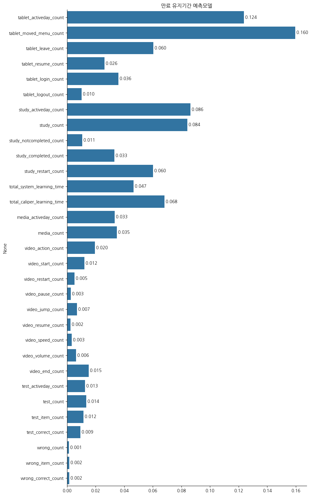
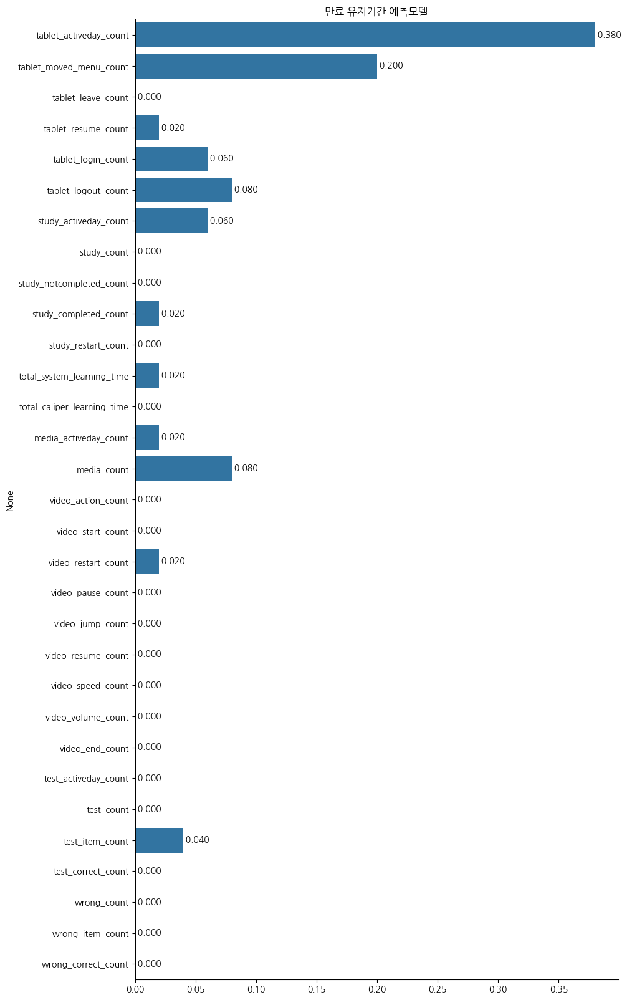

# 머신러닝 모델 구현 및 분석 보고서

## 만료회원별 만료상태유지기간 예측모델 및 영향 요인 분석

###### 빅데이터 9기 전동인

---

### 목차

1. [문제정의](#1-문제정의)
2. [데이터설명](#2-데이터-설명)
3. [데이터 탐색](#3-데이터-탐색)
4. [전처리](#4-전처리)
5. [EDA](#5-eda)
6. [아이디어](#6-아이디어)
7. [모델선정](#7-모델선정)
8. [결론](#8-결론)

---

### 1. 문제정의

- **상황**

  - 탈퇴 회원 : 손실
  - 만료 회원 : 잠재적으로 탈퇴가능한 회원
  - 만료 회원이 이후 서비스 구독을 연장하게 하는 것이 중요한 쟁점인데 만료 상태인 기간이 길어진다는 것은 학생에게 맞는 타사의 제품을 알아보고 있는 시간으로 생각할 수 있고 이 기간이 길어질 거 같은 회원에게 그에 맞는 서비스를 제공하는 것이 중요하다.

- **방향**

  - 해당 분석에서는 만료기간이 길어질 수 있는 회원을 예측하고 당사의 어떤 기능이 만료기간에 영향을 주는지 알아보는 분석을 해보고자 한다.

- **인사이트를 도출해야 하는 이유**
  - 만료유지기간이 길어진다는 것은 서비스가 아이와 맞지 않는다는 것을 의미하고 더 나아가 다른 서비스를 찾는다고 생각할 수도 있다. 만료유지기간을 길게 하는 요인이 무엇이고 어떤 부분을 보완해야 다시 고객으로 돌아올 수 있는지에 대한 방안이 필요하다.

### 2. 데이터 설명

- 데이터셋 : 천재교육 서비스 만료 및 탈퇴회원 데이터
- 형태
  - 학생 정보 : 111851
  - Feature : 54
- [컬럼](./Data_explain.md) : 별첨자료에서 제시

### 3. 데이터 탐색

---

- #### 중복값 : 없음
- #### 결측치

  |                             |        |        |
  | :-------------------------- | -----: | :----- |
  | point_gain_activeday_count  |   3955 | 3.54%  |
  | point_gain_count            |   3955 | 3.54%  |
  | point_gain                  |   3955 | 3.54%  |
  | point_loss_activeday_count  |   3955 | 3.54%  |
  | point_loss_count            |   3955 | 3.54%  |
  | point_loss                  |   3955 | 3.54%  |
  | tablet_activeday_count      |  69893 | 62.49% |
  | tablet_moved_menu_count     |  69893 | 62.49% |
  | tablet_leave_count          |  69893 | 62.49% |
  | tablet_resume_count         |  69893 | 62.49% |
  | tablet_login_count          |  69893 | 62.49% |
  | tablet_logout_count         |  69893 | 62.49% |
  | study_activeday_count       |  77821 | 69.58% |
  | study_count                 |  77821 | 69.58% |
  | study_notcompleted_count    |  77821 | 69.58% |
  | study_completed_count       |  77821 | 69.58% |
  | study_restart_count         |  78457 | 70.14% |
  | total_system_learning_time  |  78584 | 70.26% |
  | total_caliper_learning_time |  78496 | 70.18% |
  | media_activeday_count       |  79605 | 71.17% |
  | media_count                 |  79605 | 71.17% |
  | video_action_count          |  80735 | 72.18% |
  | video_start_count           |  80735 | 72.18% |
  | video_restart_count         |  80735 | 72.18% |
  | video_pause_count           |  80735 | 72.18% |
  | video_jump_count            |  80735 | 72.18% |
  | video_resume_count          |  80735 | 72.18% |
  | video_speed_count           |  80735 | 72.18% |
  | video_volume_count          |  80735 | 72.18% |
  | video_end_count             |  80735 | 72.18% |
  | test_activeday_count        |  82852 | 74.07% |
  | test_count                  |  82852 | 74.07% |
  | test_average_score          |  82852 | 74.07% |
  | test_item_count             |  83472 | 74.63% |
  | test_correct_count          |  83472 | 74.63% |
  | wrong_count                 | 104408 | 93.35% |
  | wrong_item_count            | 104408 | 93.35% |
  | wrong_correct_count         | 104408 | 93.35% |

  - 결측치 특징

    - 위의 컬럼에 대한 구분에서 유저 정보, 서비스 유지 형태 및 기간, 기타에 해당하는 부분에는 결측치가 없지만 그외의 컬럼에서 결측치 발생

    - point_gain_activeday_count, point_gain_count 의 point처럼 가장 앞의 분류가 일치한다면 결측치의 수가 대체로 동일

    - tablet_activeday_count에서 tablet처럼 tablet 분류에서 결측치가 발생하면 이후 study, total, media, video, test, wrong에 대한 컬럼에서 결측치 발생

### 4. 전처리

---

- #### 결측치 : 0으로 대체

  - 사유 : 회원 정보는 결측이나 중복값 없이 존재하지만 결측치가 발생한 부분이 대부분 서비스 내에 있는 기능에서 발생. 즉 이들을 서비스에 가입은 했지만 오답노트, 시험응시 등 해당 기능을 사용하지 않은 유저로 판단하고 전부 수치형 자료이기에 해당 서비스를 이용하지 않은 것으로 생각하여 0으로 대체

- #### memberstatus

  - 44:만료 => 0
  - 66:미납/중지 => 1
  - 88:탈퇴 => 2

- #### 학년

  - 연령대별 회원상태를 키즈~중1에서의 샘플갯수가 다른 학년에 비해 압도적으로 많고 해당 서비스의 주요 이용 고객층을 고려했을때 키즈~중1까지 연령대를 모아 최종 데이터프레임 생성

### 5. EDA

---

- ## 연령대별 회원상태 누적그래프

  

  - 거의 대부분의 만료 회원은 키즈~중1에 포진. 중1을 제외하고 그 값들이 대부분 유사하게 나타남. 특히 초4, 초5, 초6에서 다른 학년에 비해 상대적으로 높은 값을 보여줌.

- ## 회원별 유지기간 평균 그래프

  

  - 현재 데이터에선 만료회원인 상태로 있는 회원이 약 24일 정도를 유지하는 것으로 가장 길고 나머지는 무료, 유료인 과금 형태에 따른 일수차이가 나타나며 무료회원의 일수가 유료보다 다소 긴 것으로 보인다.

### 6. 아이디어

---

- **만료상태 기간 예측 모델** : 만료기간이 길어진다는 것은 해당 서비스를 계속 이용할지 고민을 하는 것과 같은 의미이다. statusgroup 컬럼에서는 회원 상태별 유지기간을 알 수 있는데 그중 만료 상태에 해당하는 'statusgroup_50_count'에서 장기 유지회원, 비장기 유지회원로 구분하여 장기회원이 될 수 있는 회원을 예측하는 모델을 생성.

### 7. 모델선정

---

[만료상태 기간 분류 모델]

- 추가적인 전처리

  - 모델 선정에 앞서 만료인 고객을 대상으로 유지일수를 예측해야하기 때문에 기존 데이터프레임에서 'statusgroup_50_count'의 값이 양수인 값만 뽑아 df_under_50라는 새로운 데이터프레임 생성.

  - X,y 선정

    - X : 학생들이 사용하는 서비스 기능에 대한 요소로 tablet_activeday_count ~ wrong_correct_count에 해당하는 컬럼만 고려. 그중 test_average_score은 실제 시험성적이 연속형자료로 들어가있는데 결측치를 처리하는 과정에서 이를 0으로 처리한 부분이 '시험을 응시하지 않았다'와는 다르게 '학생의 성적이 낮다'로 인식될 수 있기에 제외

    - y : statusgroup_50_count의 값이 만료유지기간의 평균인 24를 넘을 경우 0으로, 넘지 않을 경우 1로 분류하고 이를 새로운 target이라는 컬럼에 저장

  - 모델

    - 만료유지기간에 영향을 주는 요인으로 하여금 요인별 영향에 따라 장기 유지 회원이 될지 비장기 회원이 될지를 예측하는 모델을 만들고자 했기에 분류 모델 알고리즘을 통하여 분석시도.

    - **RandomForestClassifier**

      - n_estimators=1000
      - 결과

        - score
          - train : 0.95
          - test : 0.90
        - feature_importaces

          ***

          

          - 테블릿 메뉴 이동에 대한 부분이 영향이 가장 크고 학습, 공부시간 등이 높게 나타남. 비디오, 테스트, 오답노트 등 제공되는 서비스에 대해서는 상대적으로 낮은 영향을 볼 수 있음.

        - confusion_marix
          ||장기 predict|비장기 predict|
          |---|---|---|
          **장기** ground truth|5641|1295|
          **비장기** ground truth|931|14066|

        - 해석
          - 점수자체는 test가 낮지만 그 차이가 상대적으로 적어 일반적인 점수라고 생각할 수 있음. 하지만 feature_importaces에서 영향이 높다고 나타난 feature들이 직관적으로 생각했을때 공선성이 높을 것이라 우려가 되고 confusion_marix을 보았을 때 비장기를 비장기라고 예측하는 부분에 값이 편향되어 있는 것을 볼 수 있다.

    - **AdaBoostClassifier**

      - 결과

        - score
          - train : 0.896
          - test : 0.895
        - feature_importaces

          ***

          

          - 랜덤포레스트에 비해 태블릿 사용일이 가장 큰 영향을 준다는 것으로 파악. 태블릿, 미디어에서 유의미 있는 값들이 나타나고 윗 모델과 비슷하게 비디오, 테스트, 오답노트 등은 상대적으로 낮은 영향으로 볼 수 있다.

        - confusion_marix
          ||장기 predict|비장기 predict|
          |---|---|---|
          **장기** ground truth|5747|1189|
          **비장기** ground truth|1106|13891|

        - 해석
          - 점수는 랜덤포레스트에 비해 낮아졌지만 train과 test 사이의 차이가 비슷해짐. 하지만 confusion matrix에서 장기 predict와 비장기 ground truth를 예측하는 값이 늘어났고 큰 차이가 없는 것을 볼 수 있음. feature_importaces에서도 앞선 랜덤포레스트에 비해 값이 편향이 크게 나타난 것을 볼 수 있음

      - 결과
        - RandomForestClassifier를 활용한 모델이 더 적절해보임.

- 피어슨 상관분석

  - 랜덤 포레스트 모델에서 feature_importaces를 본다면 tablet_activeday_count,tablet_moved_menu_count이 비슷하게 값이 크다. 테블릿을 키면 메뉴로 접근하는 것은 직관적으로 생각했을때 독립적인 행동으로 보기가 어렵고 이를 검증해보고자 두 feature간의 상관분석을 진행해보고자 한다.

  - 결과
    - correaltion coefficient : 0.7367972473740119, p-value : 0.0
    - 해석 : 상관계수가 0.74로 1에 가깝다고 생각할 수 있고 p-value 역시 신뢰수준 0.05보다 작으므로 유의미한 결과라고 볼 수 있다. 즉 feature간의 연관이 있다고 생각할 수 있다.

### 8. 결론

---

- 서비스에서 제공하는 비디오, 테스트 등 기능보다는 실질적으로 테블릿을 이용하는 부분이 예측에 있어서 영향을 가장 많이 주었다. 비디오나 테스트보다는 테블릿을 통해 실습을 하는 학습이나 바로바로 당일 과제 등 학습에 직접적으로 연결된 부분을 학생이 테블릿을 통해 보다 능동적으로 할 수 있게 하는 시스템이 필요하다고 생각이 든다.

### - 개선점

---

- 결측치를 0으로 대체한 부분이 해당 분석에서 가장 아쉬운 점이다. 해당 기능을 이용하지 않는다고 생각하여 0으로 처리하였지만 0이라는 값이 서비스를 이용하지 않았다는 의미 이상으로 학생의 학업능력이 저조하다는 의미를 부여할 수 있어서 서비스를 연장할지에 대한 분석에서 부족한 처리였다고 생각한다. 이는 해당 서비스에 대한 이해가 부족하여 고객으로 등록되어 있는데 태블릿, 시험 등 기능을 이용하지 않는 것이 어떤 것을 의미하는지 알지 못하여 생긴 결과라고 생각한다. 이후 피어슨 상관분석에서 보았든 feature들 간의 공선성이 존재할 수 있기에 이를 좀 더 깊이 있게 분석하는 과정이 부족했다.

### - 후속연구

---

- feature간 공선성을 고려하고 결측치 처리를 개선하여 모델을 다시 구성해보는 연구를 하고 싶다. 더 나아가 어느정도의 만료유지기간이 탈퇴로 이어지는지를 예측하는 모델도 구성해보고 싶다.

- ### 개발 환경
  - Python(v3.12.4)
  - Jupyter(v2024.7.0)
