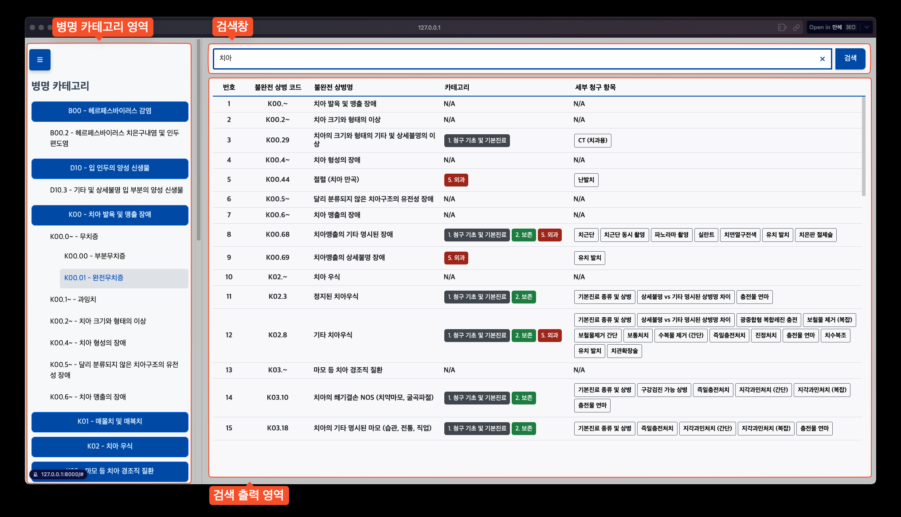

# 보험상병명 검색엔진 프로젝트 보고서

## [서비스 링크](https://oasis4dent.com/)

## 느낀점

- 자연어에 대한 처리와 웹 프레임워크를 활용한 실제 웹 서비스 개발에 대한 경험을 해볼 수 있었음. 기본적인 서비스를 구축해도 보완할 점이 많았음. 가령 특정 검색어에서 원하는 결과가 나오지 않을 경우 이를 디버깅하기 위해 수정하는 과정, 디자인적인 부분, 미비한 기능에 대한 보완을 하고 지속적으로 관찰하며 개선하는 경험을 할 수 있었음. 해당 프로젝트를 통해 이용자가 한글로 키워드를 쳤을 때 이를 어느정도 보정해주고 오탈자가 들어와도 제대로 입력되는 기능에 대해 구현해볼 수 있었으며 모듈화를 통해 Django를 효율적으로 사용하여 웹 서비스를 개발하는 경험을 할 수 있었음. 하지만 데이터 자체가 잘 정제되어 있어서 별도의 데이터에 대한 사전 전처리 없이 작업을 진행할 수 있었음.
- 팀플레이로 진행하여 깃허브를 통한 공유 작업을 경험할 수 있었음. 슬랙과 깃허브를 통해 수시로 소통하고 코드를 공유할 수 있었으며 각자의 작업을 브랜치를 따로 파서 합치는 작업도 진행하였음. 슬랙과 깃허브를 연동하여 깃허브에서 푸시를 할때 알림을 통해 볼 수 있었음. 같은 파일을 작업할 때 충돌이 발생하는 상황을 많이 경험했는데 브랜치를 나누었다 합치거나 푸시 알림 등을 통해 이를 극복할 수 있었음. 깃허브를 통한 효율적인 작업 경험과 발생할 수 있는 문제에 대해 경험해 볼 수 있는 기회였음.

---

## 프로젝트 개요
이 프로젝트는 치과 의료 보험 청구를 위한 상병 코드 검색 시스템입니다. 

Django 기반으로 개발되었으며, 사용자 친화적인 인터페이스를 통해 효율적인 코드 검색을 지원합니다.

## 프로젝트 화면




[](https://www.youtube.com/watch?v=rd_b_Vuj7J0)


## 주요 기능
- 상병 코드 및 상병명 검색
- 초성 검색 지원
- 한영 변환 검색 지원
- 유사도 기반 검색
- 카테고리별 분류 시스템
- 실시간 검색 결과 표시
- 세부 청구 항목 연동

## 기술 스택


### 언어
- Python 3.11
- JavaScript ES6+
- HTML5
- CSS3
  
### 라이브러리
- Django 4.2.16: 웹 프레임워크
- gspread 6.1.4: 구글 스프레드시트 API 클라이언트
- oauth2client 4.1.3: OAuth 2.0 인증
- rapidfuzz 3.9.7: 퍼지 문자열 매칭 및 검색
- pandas 2.0.3: 데이터 처리 및 분석
- Bootstrap 5.1.3: 프론트엔드 UI 프레임워크
- Font Awesome 6.0.0-beta3: 아이콘 라이브러리

### 프레임워크
- Django

### 외부 API
- Google Sheets API

### 개발 환경
- IDE: Visual Studio Code
- 버전 관리: Git
- 패키지 관리: pip
- 운영체제: Windows/ubuntu/MacOS 호환

## 프로젝트 구조
```
Django/
├── dental_insurance_search/          # 프로젝트 메인 디렉토리
│   ├── __init__.py
│   ├── settings.py                   # 프로젝트 설정
│   ├── urls.py                      # URL 라우팅
│   └── wsgi.py                      # WSGI 설정
│
├── search/                          # 메인 앱 디렉토리
│   ├── migrations/                  # 데이터베이스 마이그레이션
│   │   ├── __init__.py
│   │   ├── 0002_dentalclaim_and_more.py
│   │   └── 0004_delete_dentalclaim.py
│   │
│   ├── static/                      # 정적 파일
│   │   ├── css/
│   │   │   ├── styles.css          # 메인 스타일
│   │   │   ├── sidebar.css         # 사이드바 스타일
│   │   │   └── search_bar.css      # 검색바 스타일
│   │   │
│   │   └── js/
│   │       ├── scripts.js          # 메인 스크립트
│   │       ├── sidebar.js          # 사이드바 기능
│   │       └── detailButtonHandler.js  # 상세 버튼 처리
│   │
│   ├── templates/                   # HTML 템플릿
│   │   ├── index.html              # 메인 페이지
│   │   ├── sidebar.html            # 사이드바 컴포넌트
│   │   ├── search_bar.html         # 검색바 컴포넌트
│   │   └── result_table.html       # 결과 테이블
│   │
│   ├── utils/                       # 유틸리티 함수
│   │   ├── category_colors.py      # 카테고리 색상 정의
│   │   ├── category_hierarchy.py   # 카테고리 계층구조
│   │   ├── GoogleSheet.py          # 구글 시트 연동
│   │   ├── QueryCorrection.py      # 검색어 처리
│   │   └── sidebar_processors.py   # 사이드바 처리
│   │
│   ├── __init__.py
│   ├── apps.py                     # 앱 설정
│   ├── urls.py                     # 앱 URL 설정
│   └── views.py                    # 뷰 로직
│
└── manage.py                        # Django 관리 스크립트
```
## 주요 컴포넌트 설명

### 검색 시스템
- `QueryCorrection.py`: 검색어 처리 및 보정
- `GoogleSheet.py`: 구글 스프레드시트 데이터 연동
- `category_hierarchy.py`: 카테고리 계층 구조 관리

## 설치 및 실행 방법

1. 필요 패키지 설치

```bash
pip install -r requirements.txt
```

2. 서버 실행

```bash
python manage.py runserver
```

## API 키 설정
Google Sheets API 사용을 위해 `key.json` 파일을 프로젝트 루트 디렉토리(Django)에 위치시킵니다.