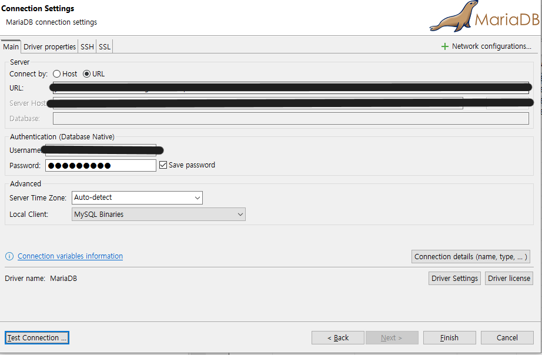
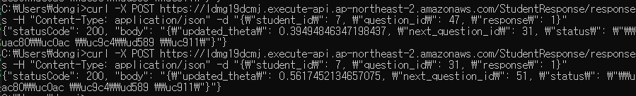

# IRT-CAT 프로젝트: AWS 환경 구축 및 아키텍처 설계

## 프로젝트 개요

### 목표

1. 파이썬 패키지를 활용해 AWS 환경에 최적화된 시스템을 구축한다.
2. AWS QuickSight를 통해 천재교육 세미나에서 보았던 학생의 능력 수준(θ)을 시각화는 것을 직접 구현해본다.

   

3. 학생의 문제 풀이 과정과 능력치에 따라 적합한 문제를 반환하는 시스템을 구축한다.
4. 새로운 문제 출제 시, 해당 문제의 문항 모수를 효율적으로 추정할 수 있는 시스템을 구축한다

## 아키텍처 설계

### 제한사항 및 데이터 준비

1. **응답 데이터**: API-gateway를 통해 post 요청을 이용하여 URL을 배포하고 직접 학생이 되었다 생각하고 정오답 데이터를 전송(RDS에 기록 적재)

2. **문제 데이터**: `edu_irt` 패키지의 데이터 생성 함수를 참고하여 필요한 문항 모수를 임의 생성하여 문제 데이터를 구성하고, 이 역시 EC2 DB에 적재.

   

   > 총 100 문제 생성

### 아키텍처 개선 과정

구축 목표에 따라, **네 번의 개선 과정을 통해 아키텍처를 보완**하였다.

#### 초기 버전

- **평가**: 데이터 및 모델에 대한 이해 부족으로 Lambda에서 θ 값을 처리하는 과정이 구체적이지 못했다.

  

#### 개선 버전 1

- **평가**: Lambda를 활용하여 RDS에 θ 값을 저장하고 업데이트하는 구조로 변경했다. 그러나 SageMaker의 비용과 복잡성 때문에 Lambda를 통해 θ 값을 간소화하는 방법을 모색했다.

  

#### 개선 버전 2 - AWS를 통해 실습

- **평가**: SageMaker를 제거하고, Lambda 기능을 세 개의 함수로 분산하여 유지 보수성 및 비용 절감 효과를 높였다. API-gateway를 활용하여 응답데이터를 RDS에 적재하는 작업까지 시도.

  - **InitialThetaHandler**: 학생의 초기 θ 값을 설정하여 RDS와 EC2에 저장 학생의 기본데이터를 입력하고 초기θ 값을 0으로 지정.
  - **ResponseDataHandler**: 학생의 응답을 기반으로 θ 값을 업데이트하고 새로운 문제를 선택해 반환 (응답 발생 시 호출).
    > `edu_irt` 패키지의 모델 부분을 참고하여 3PL 모형으로 구현.
  - **CheckEndCondition**: 종료 조건을 만족할 경우 최종 θ 값을 RDS에 저장하고 결과를 정리.

  

## AWS 환경 구축

### VPC 설정

- Public 및 Private으로 서브넷을 나누어 10.0.100.0/24와 10.0.101.0/24로 설정했다.

### RDS 설정

- MariaDB를 활용한 RDS 인스턴스를 생성하고 3306 포트를 개방하여 외부 접근이 가능하게 했다.
- 데이터베이스에 예시 데이터를 적재 후 DBeaver로 연결 확인을 완료했다.

  
  

### Lambda 설정

- 응답 데이터 처리 및 θ 값 업데이트를 위해 총 세 개의 Lambda를 생성하였으며, 필요 라이브러리인 `pymysql`을 Zip 파일로 추가했다.
- VPC와 동일한 네트워크 설정을 부여하고, IAM을 통해 필요한 권한을 설정하여 EC2의 데이터베이스 접근이 가능하도록 했다.
- **CheckEndCondition** 기능을 분리하여 ResponseHandler와 연결, 종료 조건 확인 시 자동으로 실행되도록 구현했다.

### EC2 설정

- 중간 θ 값을 저장할 EC2를 생성하였고, Private IP로 연결해 θ 값이 업데이트되도록 했다.
- MariaDB 설치 및 테이블 생성 후 파워셸을 이용해 작업을 진행했다.
  

### API Gateway 설정

- Lambda와 연동한 REST API를 POST 방식으로 설정하고 매핑 템플릿을 통해 요청 데이터를 처리하였다.
- 테스트를 통해 θ 값에 따라 문제가 정상적으로 추천되는 것을 확인했다.

## 시뮬레이션 및 검증

### 초기 θ 값 설정

- `InitialThetaHandler`를 통해 학생의 초기 θ 값을 지정하고 데이터베이스에 저장했다.

  

  > id가 7인 학생이 추가됨

### 문제 선정 및 θ 값 업데이트

- 학생의 응답에 따라 θ 값이 업데이트되며, 문제 추천이 변동되는 것을 확인했다.
- MLE(Maximum Likelihood Estimation) 방법을 활용하여 매 문제 풀이 후 θ 값을 업데이트하는 방식을 적용했다.
  

  > id가 7인 학생이 31번 문제를 맞췄을 때 세타값이 0.4에서 0.56으로 업데이트 되는 것을 볼 수 있음

  

  > 위의 기록은 rds에 student_theta_history에 적재됨.

- 조건 만족이 되면 학습종료
  
  > θ 값 0.01(임의로 지정) 범위 내에서 유지되거나 10회 이상 문제(임의로 지정)를 풀면 최종 세타 출력
  > 0.55가 된 것을 볼 수 있음

### θ 값 시각화

- quick sight를 통해 구현

  

* **평가**: 프로젝트 구상 초기, 세미나에서 봤던 학생 능력치 시각화는 성공, 이는 e-step만을 활용한 것으로 문항모수를 고정한 상태에서 학생 능력치만 시각화하고 있음. 문항 모수를 업데이트하거나 새로운 문제 데이터가 추가되는 상황에 대한 고려도 필요.
  - 추가고려사항
    - 학생의 입력정보를 어떻게 체계적으로 관리할까
    - 새로운 문제를 어떻게 다룰까
    - 문제를 출제하는 입장에서 어떻게 문제를 편하게 넣을 수 있을까? - 개발자 입장이 아닌 출제자 입장에서 생각해보기

---

## 최종 아키텍처 및 추가 구현 사항

- 문항모수 업데이트 하는 기능추가(초기엔 람다)

- 최종 FLOW-CHART
  

- 아키텍처
  

* **평가**:

---

## 느낀 점 및 배운 점

1. **Lambda에 대한 경험**: 분산 구조로 Lambda를 설정하니 유지보수와 비용 절감 효과가 컸다. 트리거를 활용하거나 Api-gateway를 이용해서 연결하여 post요청을 통해 cmd 환경에서 사용할 수 있는 시스템으로 구축.
   > 의구심 : 천재교육에서 Lambda를 활용할 때 기능을 최대한 분산하여 사용하는가? 아님 통합 하여 사용하는가?
2. **AWS 서비스 구현**: RDS와 API Gateway, Lambda의 조합을 통해 실시간 데이터 업데이트 및 학생별 문제 추천을 효율적으로 구현할 수 있었다.
   > 권한 문제와 VPC가 생각보다 복잡했지만 직접 구현하며 경험을 쌓을 수 있었음.
3. **성능 최적화**: EM 알고리즘을 효율적으로 적용하여 학생 능력치와 문항 모수를 관리할 수 있도록 하는 시스템 구측을 시도
4. 학생과 문제 출제자(관리자)가 어떻게 편하게 이용할 수 있지에 대한 탐구 - 비개발자의 입장에서
   >

## 향후 연구 방향

- 새로운 문제가 출제되었을 때 학생의 응답데이터가 없을때 문항모수를 생성할 수 있는 방법은 없는가?
- 문제의 정오답은 학생의 능력치를 측정하는 것에는 다소 근거가 부족, 풀이 과정을 활용할 방법은 없는가?
- 베이지안 IRT를 활용한 모델로 차후 개선. 공부를 하며 파이썬 패키지로 구현해보고 싶음.
