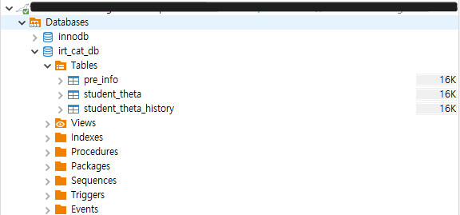

# IRT-CAT 프로젝트: AWS 환경 구축 및 아키텍처 설계

## 프로젝트 개요

### 목표

1. 파이썬 패키지를 활용해 AWS 환경에 최적화된 시스템을 구축한다.
2. AWS QuickSight를 통해 천재교육 세미나에서 보았던 학생의 능력 수준(θ)을 시각화는 것을 직접 구현해본다.

   

3. 학생의 문제 풀이 과정과 능력치에 따라 적합한 문제를 반환하는 시스템을 구축한다.
4. 새로운 문제 출제 시, 해당 문제의 문항 모수를 효율적으로 추정할 수 있는 시스템을 구축한다

## 아키텍처 설계

### 제한사항 및 데이터 준비

1. **응답 데이터**: API-gateway를 통해 post 요청을 이용하여 URL을 배포하고 직접 학생이 되었다 생각하고 정오답 데이터를 전송(RDS에 기록 적재)

   - 초기엔 테블릿을 이용하여 http요청을 통해 작업하고 싶었지만 REST-API를 통해 테스트하는 방법으로 대체

2. **문제 데이터**: `edu_irt` 패키지의 데이터 생성 함수를 참고하여 필요한 문항 모수를 임의 생성하여 문제 데이터를 구성하고, 이 역시 EC2 DB에 적재.

   

   > 총 100 문제 생성

### 아키텍처 개선 과정

구축 목표에 따라, **네 번의 개선 과정을 통해 아키텍처를 보완**

#### 초기 버전

- **평가**: 데이터 및 모델에 대한 이해 부족으로 Lambda에서 θ 값을 처리하는 과정이 구체적이지 못했다.

  

#### 개선 버전 1

- **평가**: Lambda를 활용하여 RDS에 θ 값을 저장하고 업데이트하는 구조로 변경했다. 초기 버전에 비해서는 구체적으로 변화하였지만 여전히 모델을 적용시키는 것에는 이해가 부족했다고 평가. 특히 람다를 어떻게 사용할지 Sagemaker에 대한 구체성이 부족하고 Sagemaker의 비용문제에 대한 고려가 부족했음.

  

#### 개선 버전 2 - AWS를 통해 실습

- **시도**: SageMaker를 제거하고, Lambda 기능을 세 개의 함수로 분산하여 유지 보수성 및 비용 절감 효과를 높였다. API-gateway를 활용하여 응답데이터를 통해 θ 값을 업데이트하고 문제를 반환받은 뒤 반복하여 업데이트되는 θ 값을 RDS에 적재하는 작업까지 시도.

  - **InitialThetaHandler**: 학생의 초기 θ 값을 설정하여 RDS와 EC2에 저장 학생의 기본데이터를 입력하고 초기θ 값을 0으로 지정.
  - **ResponseDataHandler**: 학생의 응답을 기반으로 θ 값을 업데이트하고 새로운 문제를 선택해 반환 (응답 발생 시 호출).
    > `edu_irt` 패키지의 모델 부분을 참고하여 3PL 모형으로 구현.
  - **CheckEndCondition**: 종료 조건을 만족할 경우 최종 θ 값을 RDS에 저장하고 결과를 정리.

  

  > 아래에서 실제 어떻게 테스트했는지 과정을 넣었습니다.(AWS 환경 구축~)

* **평가**: 프로젝트 구상 초기, 세미나에서 봤던 학생 능력치 시각화는 성공, 이는 e-step만을 활용한 것으로 문항모수를 고정한 상태에서 학생 능력치만 시각화하고 있음. 문항 모수를 업데이트하거나 새로운 문제 데이터가 추가되는 상황에 대한 고려도 필요.
  - 추가고려사항
    - 학생의 입력정보를 어떻게 체계적으로 관리할까
    - 새로운 문제를 어떻게 다룰까
    - 문제를 출제하는 입장에서 어떻게 문제를 편하게 넣을 수 있을까? - 개발자 입장이 아닌 출제자 입장에서 생각해보기

## AWS 환경 구축

### VPC 설정

- Public 및 Private으로 서브넷을 나누어 10.0.100.0/24와 10.0.101.0/24로 설정했다.
  > 사용가능한 포트로서 100, 101을 선정.

### RDS 설정

- MariaDB를 활용한 RDS 인스턴스를 생성하고 3306 포트를 개방하여 외부 접근이 가능하게 했다.
- 데이터베이스에 예시 데이터를 적재 후 DBeaver로 연결 확인을 완료했다.

  
  

### Lambda 설정

- 응답 데이터 처리 및 θ 값 업데이트를 위해 총 세 개의 Lambda를 생성하였으며, 필요 라이브러리인 `pymysql`을 Zip 파일로 추가했다.

  

  > 실제 Powershell에서 생성한 파일

- VPC와 동일한 네트워크 설정을 부여하고, IAM을 통해 필요한 권한을 설정하여 EC2의 데이터베이스 접근이 가능하도록 했다.
  > 권한 문제로 인해 어려움이 있었지만 필요한 권한을 생성하여 작업. IAM의 역할 및 권한에 대한 공부가 되었음
- **CheckEndCondition** 기능을 분리하여 ResponseHandler와 연결, 종료 조건 확인 시 자동으로 실행되도록 구현했다.
  > 임의로 10회이상 학생의 응답데이터가 쌓이거나 θ 값이 0.01의 오차로 유지될 때.
  > student_theta_history라는 테이블에 문제번호, θ 값, 학생 id를 적재하여 쿼리를 통해 문제번호를 Count(\*) 하여 체크.

### EC2 설정

- 중간 θ 값을 저장할 EC2를 생성하였고, Private IP로 연결해 θ 값이 업데이트되도록 했다.
- MariaDB 설치 및 테이블 생성 후 Powershell을 이용해 작업을 진행했다.
  

### API Gateway 설정

- Lambda와 연동한 REST API를 POST 방식으로 설정하고 매핑 템플릿을 통해 요청 데이터를 처리하였다.
- 테스트를 통해 θ 값에 따라 문제가 정상적으로 추천되는 것을 확인했다.(시뮬레이션에서 확인 가능)

## 시뮬레이션

### 초기 θ 값 설정

- `InitialThetaHandler`를 통해 학생의 초기 θ 값을 지정하고 데이터베이스에 저장했다.

  

  > id가 7인 학생이 추가됨

### 문제 선정 및 θ 값 업데이트

- 학생의 응답에 따라 θ 값이 업데이트되며, 문제 추천이 변동되는 것을 확인했다.
- MLE(Maximum Likelihood Estimation) 방법을 활용하여 매 문제 풀이 후 θ 값을 업데이트하는 방식을 적용했다.

  

  > id가 7인 학생이 31번 문제를 맞췄을 때 세타값이 0.4에서 0.56으로 업데이트 되는 것을 볼 수 있음

  

  > 위의 기록은 rds에 student_theta_history에 적재됨.

- 조건 만족이 되면 학습종료

  

  > θ 값 0.01(임의로 지정) 범위 내에서 유지되거나 10회 이상 문제(임의로 지정)를 풀면 최종 세타 출력
  > 0.55가 된 것을 볼 수 있음
  > 해당 시뮬레이션에선 10회의 횟수 제한으로 업데이트 종료

### θ 값 시각화

- quick sight를 통해 구현

  

---

## 최종 아키텍처 및 추가 구현 사항

### 최종 FLOW-CHART

### 아키텍처

### 추가된 구성요소

- **Lambda Functions**

  - `InitialItemParameterSetup`
  - `InitialThetaHandler`

- **EC2 인스턴스**

  - **베이지안 사전 추론용**
  - **문항 모수 동적 업데이트용**

- **S3**
  - 출제자의 문제데이터 저장용

### 개선 버전 2와의 차이

#### 새로운 문제 추가 및 초기 문항 모수 설정

1. **문제 파일 업로드**

   - 출제자가 새로운 문제 파일을 **S3**에 업로드

2. **Lambda 트리거 (InitialItemParameterSetup)**

   - S3에 파일이 일정 수 이상 누적되면 → `InitialItemParameterSetup Lambda`가 자동 트리거
   - 조건 확인 후, **베이지안 사전 추론용 EC2 인스턴스** 시작

3. **EC2 인스턴스에서 작업 수행**

   - S3에서 문제 데이터를 로드하여 전처리
   - **베이지안 사전 분포**를 기반으로 초기 문항 모수 추정

4. **초기 문항 모수 저장**
   - 추정된 초기 문항 모수를 **EC2 MariaDB**에 저장

---

#### 학생 응답 데이터 기반 문항 모수 업데이트

1. **Lambda 트리거 (ItemParameterUpdate)**

   - EC2 MariaDB에 학생 응답 데이터가 일정 수 이상 누적되거나 → 주기적 조건 만족 시 `ItemParameterUpdate Lambda` 트리거
   - Lambda가 조건 확인 후, **문항 모수 동적 업데이트용 EC2 인스턴스** 시작

2. **EC2 인스턴스에서 EM 알고리즘 수행**

   - **학생 응답 데이터**를 기반으로 EM 알고리즘 수행하여 문항 모수 업데이트

3. **문항 모수 업데이트 저장**
   - 문항 모수가 수렴하면, **EC2 MariaDB**에 업데이트된 문항 모수 저장

---

### 개선 이유

1. 문항모수가 있는 문제 업데이트

- 기존 문항모수가 있는 문제는 일정 주기가 되었을때 EM알고리즘을 통해 적재된 학생 능력치를 활용하여 문항모수를 업데이트 진행.
- 대량의 문제를 다루기때문에 매번 람다에서 처리하기보다는 람다가 Ec2 인스턴스를 트리거 하여 문항모수를 업데이트. 업데이트가 되면 DB에 저장

2. 문항모수가 없는 문제 업데이트

- 새로 생성된 문제는 문항 모수가 없음
- 출제자가 문제를 출제하면 S3에 적재(비정형 문제에 대한 상황까지 고려)
- `베이지안 사전 추론 알고리즘`을 통해 초기 문항 모수 추정

  > 문제에 대한 정보가 부족할 때 분포를 통한 가정으로 대략적 예측

  > 학생들이 문제를 풀면서 쌓인 데이터를 활용해서 업데이트

  > 장점 : 초기 데이터가 부족해도 예측을 빠르게 생성가능.

### 실제 초등 2학년 수학문제(덧셈/뺄셈)를 출제했다 가정하고 가상 시뮬레이션

1. **문제 출제 및 S3 업로드**

   - 출제자가 초등 2학년 수학 문제(덧셈/뺄셈)를 작성하여 S3 버킷에 업로드
   - 문제 설명, 정답, 학습 목표 포함 (난이도 정보 없음)

2. **Lambda 트리거**

   - S3 파일이 일정 수 이상 누적되면 `InitialItemParameterSetup Lambda` 트리거
   - 새로운 문제에 대한 초기 문항 모수 설정 필요 여부 확인 후, EC2 인스턴스 시작

3. **EC2에서 문제 파일 다운로드 및 전처리**
   - S3에서 문제 파일 다운로드 후, 문제 유형(덧셈/뺄셈)과 학습 목표 분석
   - 사전 분포 설정 준비

$$
a(난이도)\sim \mathcal{N}(0.5, 0.1)
$$

    > 초2라는 점, 덧셈/뺄셈이라는 점을 고려해서 난이도를 평균 0.5로 가정-적당히 풀 수 있는 난이도를 의미

    > 초2 덧셈뺄셈은 학생들의 학업 성취도 평가보다는 학습의 목적일거라 생각하여 난이도의 큰 편차가 없을 것이라 생각하여 0.1로 가정

4. **사전 분포 및 우도 함수 설정(난이도만 추정하는 것을 예시)**
   - 사전 분포 설정 후, 초등 저학년 학생들이 문제를 풀 확률을 가정하여 우도 함수 설정

$$
P(X_i = 1 \mid \theta_i, a) = \frac{1}{1 + e^{-(\theta_i - a)}}
$$

$$
X_i = 1 : 학생 \, i \, 가 \, 문제를 \, 맞춘 \, 경우 \\
X_i = 0 : 학생 \, i \, 가 \, 문제를 \, 틀린 \, 경우
$$

    - 여러 학생일 경우

$$
P(X \mid a) = \prod_{i} \left( \frac{1}{1 + e^{-(\theta_i - a)}} \right)^{X_i} \cdot \left( 1 - \frac{1}{1 + e^{-(\theta_i - a)}} \right)^{1 - X_i}
$$

$$
X_i = 1인 경우 첫 번째 항을 사용하여 정답 확률을 곱하고, \\
X_i = 0인 경우 두 번째 항을 사용하여 오답 확률을 곱함.
$$

5. **사후 확률 계산 및 초기 모수 추정**
   ### 사후 확률 계산

$$
P(a | X) = \frac{P(X | a) \cdot P(a)}{P(X)}
$$

$$
P(X): 정규화 상수로, MAP 추정에서는 무시 가능
$$

$$
P(a | X) \propto P(X | a) \cdot P(a)
$$

- MAP으로 초기 난이도설정

$$
a_{\text{MAP}} = \arg \max_{a} \, P(X \mid a) \cdot P(a)
$$

$$
P(X \mid a) \text{는 우도 함수로, 학생의 응답 데이터 } X \text{가 주어졌을 때 난이도 } a \text{일 확률을 의미} \\
P(a) \text{는 사전 확률로, 난이도 } a \text{에 대한 초기 가정}
$$

    > 이 과정을 통해, 초기에 난이도를 추정할 수 있으며 이후 학생들의 데이터를 추가로 받아 점진적으로 업데이트할 수 있음.

---

6. **초기 모수 저장 및 문제 제공**

   - 초기 모수를 MariaDB에 저장 후, 문제 제공 시작
   - 학생들의 실제 응답 데이터를 수집하여 정답률 기록

7. **업데이트 및 최종 모수 조정**
   - 일정 시간이 되면 `ItemParameterUpdate Lambda` 트리거
   - EC2에서 EM 알고리즘 수행, 사후 확률 업데이트 및 최종 문항 모수 도출
   - 최종 문항모수를 MariaDB에 업데이트

- **평가**: 새로운 문제가 생성된다는 상황에서 생각해본 아키텍처. EM 알고리즘에 대해 생각하며 닭이 먼저인지 달걀이 먼저인지와 같은 고민에 빠졌지만 초기 문항 모수를 추론하는 방법을 조사한 후 적용해본 사례. 람다에서 모든 과정을 처리하던 이전 버전과는 다르게 Ec2 인스턴스를 구성하여 작업을 분산. 실제 현업에서 문제를 어떻게 추가하는지 궁금하고 일을 할 수 있다면 이에 대한 정보를 취합하여 프로젝트를 발전시켜보고 싶음.

---

## 느낀 점

1. **Lambda에 대한 경험**: 분산 구조로 Lambda를 설정하니 유지보수와 비용 절감 효과가 컸다. 트리거를 활용하거나 Api-gateway를 이용해서 연결하여 post요청을 통해 cmd 환경에서 사용할 수 있는 시스템으로 구축.
   > 의구심 : 천재교육에서 Lambda를 활용할 때 기능을 최대한 분산하여 사용하는가? 아님 통합 하여 사용하는가?
2. **AWS 서비스 구현**: RDS와 API Gateway, Lambda의 조합을 통해 실시간 데이터 업데이트 및 학생별 문제 추천을 효율적으로 구현할 수 있었다.
   > 권한 문제와 VPC가 생각보다 복잡했지만 직접 구현하며 경험을 쌓을 수 있었음.
3. **성능 최적화**: EM 알고리즘을 효율적으로 적용하여 학생 능력치와 문항 모수를 관리할 수 있도록 하는 시스템 구측을 시도
   > Ec2 인스턴스를 분리하거나 데이터 종류에 따라 DB의 종류도 다르게 배치하는 방식을 지속적으로 탐구.
4. **아쉬움**학생과 문제 출제자(관리자)가 어떻게 편하게 이용할 수 있지에 대한 탐구 - 비개발자의 입장에서 고려
   > 아직 현업 경험이 없기 때문에 실제 문제가 어떻게 추가되는지 알기 어려움. 현업에서 일한다면 이에 대한 연구를 하고 이후 아키텍처를 구상해보고 싶음

## 향후 연구 방향

- 문제의 정오답은 학생의 능력치를 측정하는 것에는 다소 근거가 부족, 풀이 과정을 활용할 방법은 없는가?/ 학생의 건강 상태는 고려의 대상이 아닌가? 이런 고려의 대상에 대해 심도 있는 연구를 해보고 싶음.

- 베이지안 사전 추론을 활용한 모델로 차후 개선. 공부를 하며 해당 알고리즘을 파이썬 패키지로 구현해보고 싶음.
