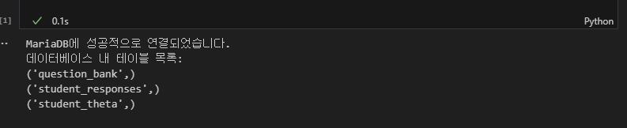
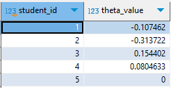
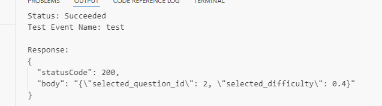
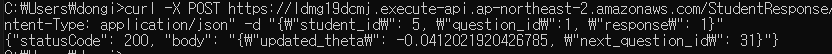
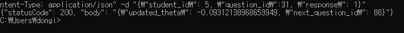
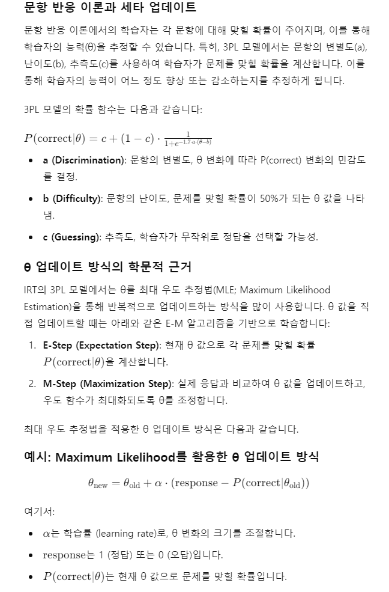

# IRT-CAT aws 환경 구축

## 요약

### 목표

1. 실제 파이썬 패키지를 활용해서 aws 환경에서 필요한 상태로 가공한다
2. aws를 통하여 아래와 같이 학생의 능력 수준을 quicksight를 통하여 시각화한다.(aws를 통해 실제 서비스를 구현)

- 

3. 학생은 문제를 어떻게 풀고 능력치에 따라 새로운 문제를 어떻게 반환할 것인가
4. 새로운 문제를 출제할 경우, 해당 문제의 문항모수를 어떻게 추정할 것인가

### 결과

### 느낀점/배운 점

---

## 세부 내용

### 제한사항

#### 응답 데이터

- 실제 테블릿을 통하여 응답데이터를 받아 구현하는 것은 어렵기에 응답데이터를 미리 생성하여 진행. edu_irt 패키지의 데이터 생성 함수를 통해 응답데이터 생성. 최종적으로 csv파일로 저장.

  

#### 문제 데이터

- 문제 데이터 역시 필요한 문항모수를 임의로 생성. edu-irt 패키지를 참고하여 데이터 생성. 최종적으로 csv파일로 저장.

  

### 아키텍처 설계

`총 3번의 과정을 통하여 아키텍처를 보완`

#### 초기\_ver

!

- ##### 평가: 기본적인 흐름만 시각화. 그러나 데이터 및 모델에 대한 이해가 부족하여 lambda에서 구체적으로 어떻게 θ 값을 가져올지에 대한 이해가 부족

#### 개선\_ver1


- ##### 평가 : lambda를 활용하여 rds에 적재하고 θ을 업데이트 받는 구조로 구현. 하지만 sagemaker의 비용문제와 더불어 해당 프로젝트에서 구현하고자 하는 목표에 비해 복잡하다고 판단. sagemaker에서 θ 값을 업데이트 받는 과정을 lambda를 통해 간소화해보고자 함.

#### 개선\_ver2


- sagemaker를 제거하는 대신 앞선 단계에서 하나의 lambda가 진행하던 과정을 총 3개의 lambda로 구분하여 나누어 처리

  - 분산 처리 이유 : 유지 보수가 편함 / 규모가 커졌을 때 비용 절감 가능

    1. InitialThetaHandler: 초기 θ 값 설정
       이 함수는 학생의 초기 θ 값을 설정하고, RDS와 EC2의 student_theta 테이블에 저장합니다. 처음 접속 시에만 호출됩니다.

    2. ResponseDataHandler: 응답 처리, θ 값 업데이트, 다음 문제 선택
       이 함수는 학생의 응답(정답 또는 오답)을 받아 θ 값을 업데이트하고, 새로운 문제를 선택하여 반환하는 역할을 합니다. 매번 응답이 들어올 때마다 자동으로 호출됩니다.

    3. CheckEndCondition: 검사 종료 여부 확인 및 최종 θ 값 저장
       학생이 일정 횟수의 문제를 풀고 종료 조건을 만족할 경우, 최종 θ 값을 RDS에 저장하고 결과를 정리합니다. 이 함수는 테스트 종료 시점에 한 번 호출됩니다.

### 실습

#### AWS환경구축 - 개선\_ver2로 시도

##### VPC

- public, private으로 나누어 서브넷을 생성하고 각각 10.0.100.0/24, 10.0.101.0/24로 생성

##### RDS

- rds 생성
- 인바운드 규칙을 통해 3306포트를 사용할 수 있게 적용. 소스를 0.0.0.0/0을 입력하여 외부에서 접근할 수 있게 함.
- dbeaver를 통해 연결

  

- 예시 데이터 적재

##### LAMBDA

- 3개의 람다 생성
- rds 이용을 위해 pymysql이 필요하지만 없기에 별도로 zip파일로 만들어 람다 함수 코드 파일을 추가 -> 이 부분에서 막힘


- EC2 데이터베이스에 접근중
- VPC를 ec2와 동일하게 설정
- 권한이 필요함 -> iam을 통하여 awslambdavpcaccessexecute 권한부여
- ```
  네트워크 인터페이스 생성 권한
  네트워크 인터페이스 정보 조회 권한
  네트워크 인터페이스 삭제 권한
  보안 그룹 조회 권한
  서브넷 정보 조회 권한
  VPC 정보 조회 권한
  ```
- 권한 부여가 생각보다 어려움


- IAM권한 이후 이것도 변경


- 계속 시도중 -> 성공

- CheckEndCondition를 조건을 통해 자동으로 실행되도록 구현 (ResponseHandler와 연결하여 사용)
- 분리 이유, 검사 종료 로직이 어려워지면 관리하기 편해지고 시간 복잡도 면에서 이득일 수 있음

##### EC2

- 중간에 세타값을 저장할 EC2를 생성. vpc를 제외하고 작업진행. 파워셀에서 작업
- mariadb생성 후 테이블 생성
  
- 11/11 : 연결 재시도
  
  - 파이썬에선 연결 이상 없음. -> 그럼 뭐가 문제지
  - 프라이빗 ip로 하니 연결됨. 왜지?

##### API gateway

- rest apt로 지정하고 post로 설정하고 람다랑 통합.
- lambda에서 직접 권한 부여. aws서비스에서 arn을 추가하여(id와 api id 필요)

---

#### 시뮬레이션

##### 초기람다설정

- id가 5인 학생 추가



##### 문제선정



##### 세타값 업데이트

- 넘파이가 필요
  
  > 람다는 리눅스 기반이기에 윈도우 넘파이 사용불가. scipy를 통해 추가가능
  > 

이렇게 세타값이 업데이트 됨

##### api gateway를 통해 url을 배포하고 api테스트 실시

> curl -X POST https://ldmg19dcmj.execute-api.ap-northeast-2.amazonaws.com/StudentResponse/responses -H "Content-Type: application/json" -d "{\"student_id\": 2, \"question_id\": 2, \"response\": 1}"
> 매핑템플릿

```
{
  "student_id": "$input.path('$.student_id')",
  "question_id": "$input.path('$.question_id')",
  "response": "$input.path('$.response')"
}

```

- 정상적으로 작동은 하지만 세타값이 바뀌어도 계속 2번문제를 추천
- 데이터 양이 문제인가? 증강시도 => 성공

### 시뮬레이션*개선ver2*최종

1. 초기 세타값 지정


- 학생 id가 5인 학생 추가

2. 세타값 업데이트 및 문제 추천
   

- 1번문제를 정답을 풀었을 때 세타값이 업데이트 되고 31번 문제를 추천

  

- 31번 문제를 맞추면 다음 문제를 추천하고 세타값이 업데이트 되는 것을 볼 수 있음.

- MLE를 활용하여 한 문제를 풀때마다 세타 값을 업데이트하는 방식

3. 학생의 세타값은 계속 누적되어 저장


- ##### 평가 : 프로젝트 구상 초기, 세미나에서 봤던 학생 능력치 시각화는 성공, 이는 e-step만을 활용한 것으로 문항모수를 고정한 상태에서 학생 능력치만 시각화하고 있음. 문항 모수를 업데이트하거나 새로운 문제 데이터가 추가되는 상황에 대한 고려도 필요.

---

#### 최종\_ver

- 대시보드 툴 이용
- 람다 함수 개선
  
- EM 알고리즘 구현

---

# 1109 이효준님이랑 면담

- 나의 최종목표는 EM알고리즘을 어떻게 효율적으로 관리할 것인가
- 문제와 학생 능력치를 어떻게 배치하는 것이 효율적인가
- 근거까지
- 최종결과물 나의 이상적인 아키텍처
