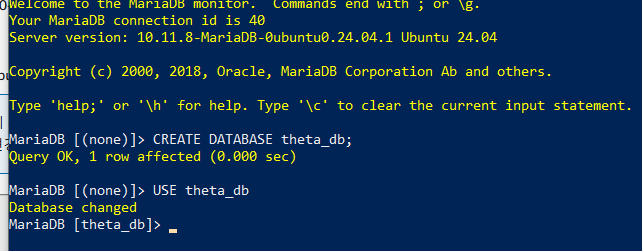

# IRT-CAT aws 환경 구축

## 목표

1. 실제 파이썬 패키지를 활용해서 aws 환경에서 필요한 상태로 가공한다
2. aws를 통하여 아래와 같이 학생의 능력 수준을 quicksight를 통하여 시각화한다.(aws를 통해 실제 서비스를 구현)

- 

3. 이를 통해 필요한 인사이트를 도출해본다.
   - 문제은행은 어떻게 만들것인가?(어떻게 문제를 계속 업데이트 할 것인가?>)

## 제한사항

### 응답 데이터

- 실제 테블릿을 통하여 응답데이터를 받아 구현하는 것은 어렵기에 응답데이터를 미리 생성하여 진행. edu_irt 패키지의 데이터 생성 함수를 통해 응답데이터 생성. 최종적으로 csv파일로 저장.

  

### 문제 데이터

- 문제 데이터 역시 필요한 문항모수를 임의로 생성. edu-irt 패키지를 참고하여 데이터 생성. 최종적으로 csv파일로 저장.

  

## 아키텍처 설계

`총 3번의 과정을 통하여 아키텍처를 보완`

### 초기\_ver

- 기본적인 흐름만 시각화. 그러나 데이터 및 모델에 대한 이해가 부족하여 lambda에서 구체적으로 어떻게 θ 값을 가져올지에 대한 이해가 부족

### 개선\_ver1

- lambda를 활용하여 rds에 적재하고 θ을 업데이트 받는 구조로 구현. 하지만 sagemaker의 비용문제와 더불어 해당 프로젝트에서 구현하고자 하는 목표에 비해 복잡하다고 판단. sagemaker에서 θ 값을 업데이트 받는 과정을 lambda를 통해 간소화해보고자 함.

### 개선\_ver2

- sagemaker를 제거하는 대신 앞선 단계에서 하나의 lambda가 진행하던 과정을 총 4개의 lambda로 구분하여 나누어 처리

  - 분산 처리 이유 : 유지 보수가 편함 / 규모가 커졌을 때 비용 절감 가능

    - 초기 데이터 처리 Lambda

      - 기능: 학생이 처음 접속했을 때 초기 데이터 (예: session_id, 초기 θ 값 등)를 설정하고 RDS에 저장.
      - 이점: 초기 데이터 처리가 별도로 분리되어 있어, 학생이 처음 접속할 때마다 새로운 Lambda를 호출할 필요 없이, 초기 설정 단계만 처리함.

    - 응답 처리 및 θ 값 계산 Lambda

      - 기능: 학생이 응답을 제출할 때마다 응답 데이터를 처리하고 θ 값을 계산하여 RDS에 저장.
      - 이점: 매번 학생이 문제를 풀 때마다 호출되며, 응답 데이터를 기반으로 능력치를 업데이트함. 이 Lambda는 특정 문제의 응답 데이터만 처리하기 때문에 특정 목적에 집중하여 최적화가 가능함.

    - 문항 선택 및 θ 값에 따른 문제 제공 Lambda

      - 기능: 현재 θ 값에 맞는 문제를 선택하여 제공하는 기능 담당. RDS에서 θ 값과 적합한 문제 데이터를 조회하고, 이를 API Gateway를 통해 학생에게 전달.
      - 이점: θ 값에 따른 문제 선택과 제공이 별도로 분리되어, 문제 선택 로직을 간소화하고, 필요 시 문제 선택 기준을 개선할 수 있음.

    - 최종 평가 및 검사 종료 Lambda:
      - 기능: 특정 기준에 도달하거나 검사 종료 조건이 충족되면 최종 θ 값을 저장하고, 종료 상태를 RDS에 업데이트.
      - 이점: 검사 종료 시점에 대한 평가 및 데이터 정리가 별도로 이루어져, 불필요한 호출을 줄이고 마지막 단계에서만 실행되므로 Lambda 호출 빈도를 낮출 수 있음.

### AWS 구현 - 개선\_ver2로 시도

#### VPC
- public, private으로 나누어 서브넷을 생성하고 각각 10.0.100.0/24, 10.0.101.0/24로 생성

#### RDS
- rds 생성
- 인바운드 규칙을 통해 3306포트를 사용할 수 있게 적용. 소스를 0.0.0.0/0을 입력하여 외부에서 접근할 수 있게 함.
- dbeaver를 통해 연결

  

- 예시 데이터 적재

#### LAMBDA
- 4개의 람다 생성
- rds 이용을 위해 pymysql이 필요하지만 없기에 별도로 zip파일로 만들어 람다 함수 코드 파일을 추가 -> 이 부분에서 막힘

  

- EC2 데이터베이스에 접근중 
- VPC를 ec2와 동일하게 설정
- 권한이 필요함

#### EC2 
- 중간에 세타값을 저장할 EC2를 생성. vpc를 제외하고 작업진행. 파워셀에서 작업 
- mariadb생성 후 테이블 생성

